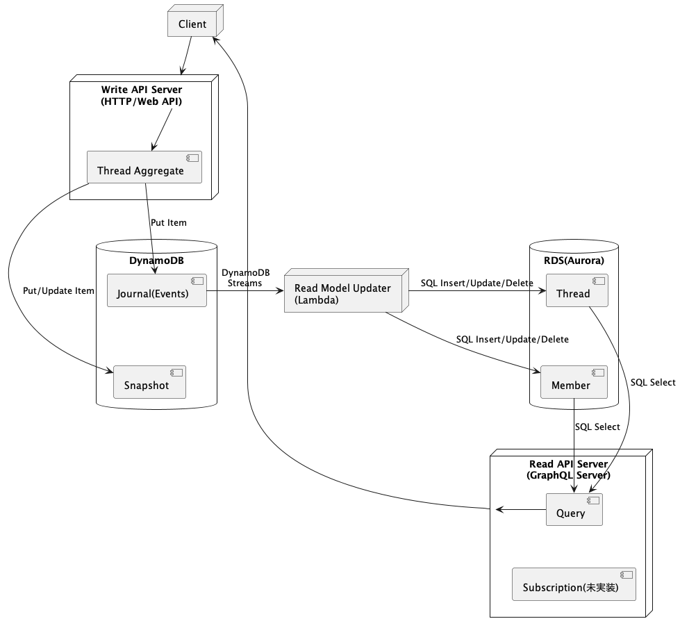

# cqrs-es-example-rs

ステータス:実装中

このリポジトリは、RustでのCQRS/ESのサンプル実装です。

## 概要

### コンポーネント構成

- Write API (WIP)
    - 書き込み専用のWeb API
- Read Model Updater
    - ジャーナルを基にリードモデル構築するLambda
- Read API
    - GraphQLサーバ(Query,Subscription)

### システム構成図

## 開発環境

- [ツールのセットアップ](docs/TOOLS_INSTALLATION.md)

### ローカル環境

- [ローカルマシンでのデバッグ](docs/DEBUG_ON_LOCAL_MACHINE.md)
- [Docker Composeでのデバッグ](docs/DEBUG_ON_DOCKER_COMPOSE.md)
- [ローカルKubernetesでのデプロイ](docs/DEPLOY_TO_LOCAL_K8S.md)
- [Minikubeへのデプロイ](docs/DEPLOY_TO_MINIKUBE.md)

### AWS環境

- [AWSのセットアップ](docs/AWS_SETUP.md)
- [EKSへのデプロイ](docs/DEPLOY_TO_EKS.md)
