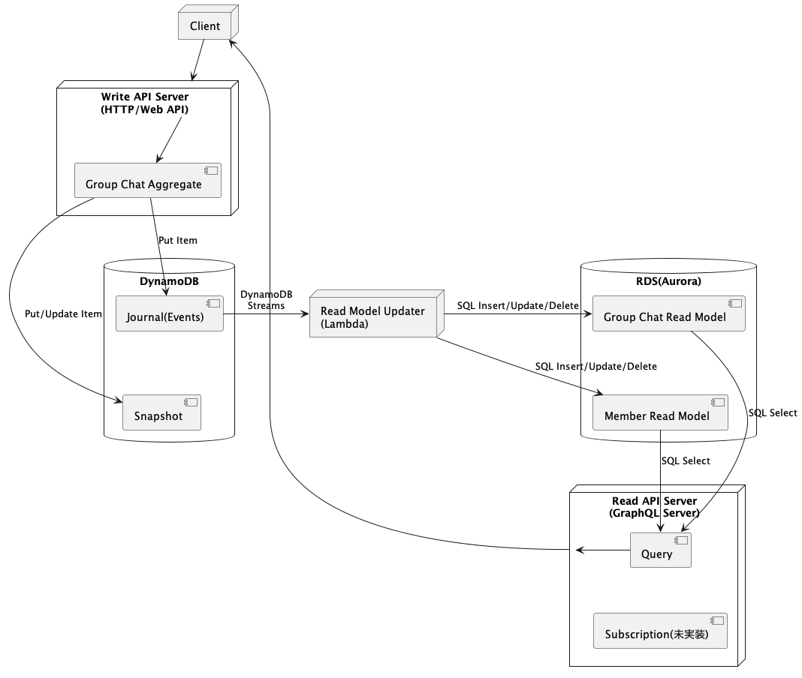

# cqrs-es-example-rs

Status: In Implementation

This is an example of CQRS/Event Sourcing and GraphQL implemented in Rust.

This project uses [j5ik2o/event-store-adapter-rs](https://github.com/j5ik2o/event-store-adapter-rs) for Event Sourcing.

Please refer to [here](https://github.com/j5ik2o/cqrs-es-example) for implementation examples in other languages.

[日本語](./README.ja.md)

## Overview

### Component Composition

- Write API Server
    - API is implemented by GraphQL (Mutation)
    - Event Sourced Aggregate is implemented by [j5ik2o/event-store-adapter-rs](https://github.com/j5ik2o/event-store-adapter-rs)
- Read Model Updater
    - Lambda to build read models based on journals
    - Locally, run code that emulates Lambda behavior (local-rmu)
- Read API Server
    - API is implemented by GraphQL (Query)
 
## Stack

This OSS repository mainly utilizes the following technology stack.

- [tokio-rs/axum](https://github.com/tokio-rs/axum)
- [async-graphql/async-graphql](https://github.com/async-graphql/async-graphql)
- [launchbadge/sqlx](https://github.com/launchbadge/sqlx)
- [j5ik2o/event-store-adapter-rs](https://github.com/j5ik2o/event-store-adapter-rs)

## System Architecture Diagram

## Development Environment

- [Tool Setup](docs/TOOLS_INSTALLATION.md)
- [Build and Test](docs/BUILD_AND_TEST.md)

### Local Environment

- [Debugging on Local Machine](docs/DEBUG_ON_LOCAL_MACHINE.md)
- [Debugging on Docker Compose](docs/DEBUG_ON_DOCKER_COMPOSE.md)
- [Deploying to Local Kubernetes](docs/DEPLOY_TO_LOCAL_K8S.md)
- [Deploying to Minikube](docs/DEPLOY_TO_MINIKUBE.md)

### AWS Environment

- [AWS Setup](docs/AWS_SETUP.md)
- [Deploying to EKS](docs/DEPLOY_TO_EKS.md)

## Links

- [Common Documents](https://github.com/j5ik2o/cqrs-es-example)
